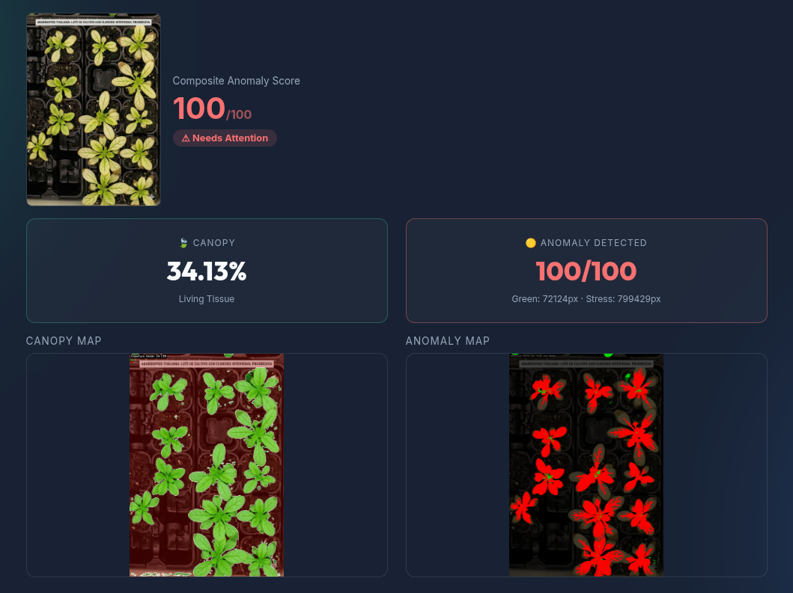

# 🌱 AgricultureHelper: Multi-Agent Plant Monitoring System

Welcome to the **AgricultureHelper** repository. This project aims to build a robust, edge-first Multi-Agent System (MAS) to monitor plant health using a combination of environmental sensors and computer vision.



## 🎯 Current Project Focus: Tier 1 MVP

We are currently in the early planning and development stages, focusing entirely on a **Frictionless Tier 1 MVP** designed for ultra-low-cost edge devices (e.g., Raspberry Pi) in offline or remote greenhouse environments.

The architecture is built on a **Blackboard Pattern** and orchestrated via **LangGraph**, ensuring we can later seamlessly plug in heavy Vision-Language Models (VLMs) and Cloud APIs in future scaling phases.

### 🚀 Tier 1 Development Roadmap

*   **Phase 1: The "Dumb" Extractors**
    *   Set up Python OpenCV pipelines to continuously extract an HSV "Green Ratio" as a universal proxy for plant growth/health.
    *   Deploy MQTT brokers to ingest basic IoT soil/temperature sensors into a local SQLite/TimescaleDB.
*   **Phase 2: The Anomaly Brain**
    *   Implement lightweight edge anomaly detection (e.g., `SciKit-Learn IsolationForest`).
    *   Establish the unified `PlantHealthState` Blackboard.
*   **Phase 3: The Investigation Router**
    *   Build the LangGraph Supervisor to route logic (e.g., *Is the green canopy dropping because moisture is low?*).
*   **Phase 4: The Farmer Interface**
    *   Deploy a local SMS or Gradio UI to alert the human farmer "In The Loop" whenever an unknown visual anomaly occurs.

## 🛠️ Cómo ejecutar el proyecto

### 1. Requisitos y Entorno Virtual
Se recomienda utilizar un entorno virtual para instalar las dependencias de manera aislada:
```bash
# Crear y activar entorno virtual
python -m venv .venv
source .venv/bin/activate  # En Linux/Mac
# .venv\Scripts\activate   # En Windows

# Instalar dependencias
pip install -r requirements.txt
```

### 2. Levantar los Servicios

Para probar el flujo completo con la API y la interfaz visual:

#### Servicio Principal (FastAPI + Interfaz Web)
El servidor ahora procesa las imágenes, interactúa con los sensores simulados y sirve la interfaz web (frontend) directamente usando Jinja2.
```bash
uvicorn src.api.app:app --reload
```
- La **API base y de análisis** estará disponible de forma nativa en `http://localhost:8000`.
- La **Interfaz de Usuario (Frontend)** se puede abrir en tu navegador ingresando a `http://localhost:8000/ui`.

### 📸 Pipeline de Visión y Mapas Diagnósticos

El sistema de visión (ubicado en `src/core/vision_extractor.py`) está diseñado de forma modular para:
- Calcular el porcentaje de cobertura verde viva (canopy).
- Contar el número de plantas individuales analizando bandejas de cultivo en cuadrícula.

**Viendo los Mapas de Diagnóstico:**
Al probar las imágenes desde el frontend o con los tests, el pipeline genera automáticamente un archivo de imagen combinado en formato PNG guardándolo en la carpeta `diagnostic_maps_demo/`. Estos "mapas" proveen *feedback visual* verificable:
- **Verde Semitransparente**: Capa superpuesta indicando el tejido verde/vivo detectado.
- **Rojo Semitransparente**: Capa superpuesta indicando lo ignorado (suelo, maceta, o tejido muerto).
- **Contornos Blancos**: Borde de las hojas o plantas para comprobar la exactitud de segmentación y conteo.
- Valores como el Porcentaje de Cobertura quedan impresos sobre la propia imagen.


#### Probar los scripts localmente en CLI
```bash
# Correr el archivo de pruebas y generación unitaria
python test_api.py

# Correr la suite de pruebas unitarias
pytest test_api.py
```

---

### 📷 Consideraciones Técnicas: Ground Sample Distance (GSD)
Actualmente, el algoritmo de visión (`src/core/vision_extractor.py`) depende de umbrales estáticos en píxeles (ej. eliminar ruido menor a 200px). Esto significa que el sistema es susceptible a errores si la distancia de la cámara a la bandeja cambia (modificando el GSD). 

*   **A futuro:** Se recomienda implementar un sistema de calibración dinámica (ej. usando un marcador físico de tamaño conocido en la bandeja) para que el algoritmo calcule la relación de *píxeles/cm* y ajuste los parámetros automáticamente sin importar la altura de la cámara.


---

*For a full breakdown of the agent design and theoretical architecture (including scaling to Tier 2 and Tier 3), see the `multiagent_plant_monitoring_proposal.md`.*
