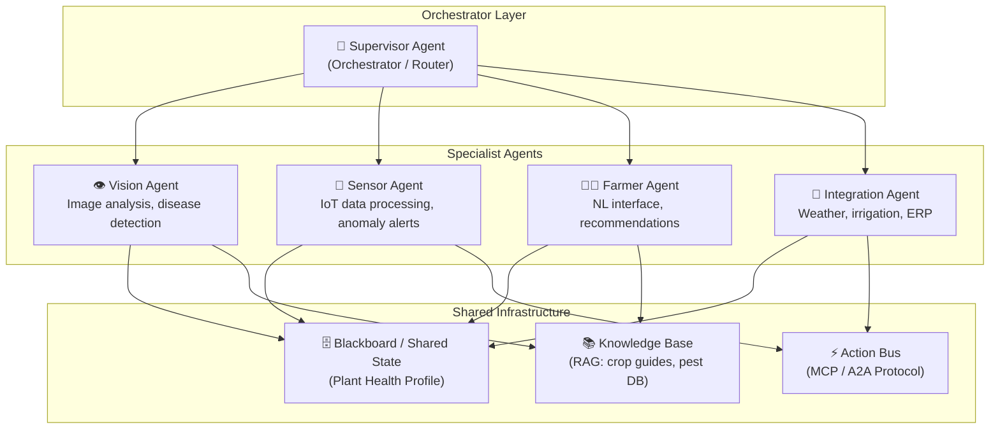
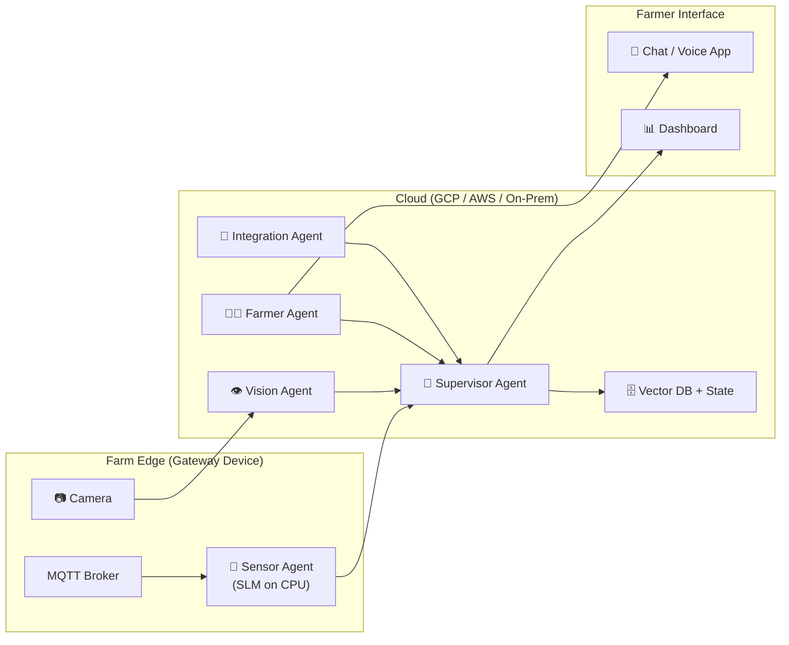

# 🌱 Multi-Agent Plant Monitoring Service — Architecture Proposal

> *A short expert proposal on strategies and architectures for a multiagent service that monitors plants from visual, sensor, farmer interaction, and system integration fronts.*

---

## 1. Problem Statement

Modern agriculture demands holistic plant health monitoring that integrates **multiple modalities**:

| Front | Data Source | Challenge |
|:------|:-----------|:----------|
| **Visual** | Cameras, drones, satellite imagery | Detecting disease, pests, nutrient deficiency from pixels |
| **Sensor data** | IoT sensors (soil moisture, pH, temperature, humidity, light) | Continuous real-time streams, anomaly detection |
| **Farmer interaction** | Natural language (chat, voice), manual observations | Translating domain expertise into actionable inputs |
| **System integration** | Weather APIs, market prices, irrigation controllers, ERP systems | Coordinating actions across external platforms |

No single agent can handle all of these effectively. A **multi-agent system (MAS)** is the natural architecture.

---

## 2. Recommended Architecture: Hierarchical MAS with Specialized Agents

### 2.1 High-Level Design



### 2.2 Why Hierarchical + Blackboard?

Drawing from the **Unified Theory of Agents** taxonomy:

| Dimension | Choice | Rationale |
|:----------|:-------|:----------|
| **Organization** | **Hierarchical** | A Supervisor Agent routes tasks to specialists, preventing chaos from concurrent analysis |
| **Coordination** | **Blackboard** (shared `PlantHealthState`) | All agents contribute to a unified plant profile — the Sensor Agent writes soil data, the Vision Agent writes disease scores, and the Farmer Agent reads all of it |
| **Social behavior** | **Cooperative** | All agents share one goal: maximize plant health |
| **Agent diversity** | **Heterogeneous** | Each agent uses different models and tools suited to its modality |
| **Architecture** | **Hybrid (BDI)** | Agents plan (deliberative) but react to real-time sensor alerts (reactive) |

---

## 3. Agent Specifications

### 3.1 👁️ Vision Agent

**Purpose**: Provide a frictionless baseline for plant health by tracking visual changes (size, color, anomalies). Because hardware constraints dictate what computer vision can achieve, the Vision Agent scales across **three distinct hardware tiers**:

**Tier 1: Ultra-Low Cost / Remote Edge (Raspberry Pi, Offline)**
*   **The Problem:** Cannot run heavy Vision-Language Models (VLMs); zero budget; spotty or zero internet.
*   **The Solution:** The Vision Agent acts entirely as a **"Dumb Green Pixel Extractor"**. A tiny Python script (OpenCV) runs hourly on a CPU, extracting the percentage of green pixels as a proxy for health.
*   **Agentic Logic:** When the green count drops unexpectedly, the Vision Agent lacks the "brain" to diagnose the issue. Instead, the Multi-Agent System becomes an **Investigation Router**. It checks the **Sensor Agent** (Did moisture drop?). If sensors are normal, it pings the **Farmer Agent** via SMS/Local Chat: *"Green canopy dropped 12% in plot 4, sensors are normal. Can you manually inspect this image for pests?"*

**Tier 2: Medium-End Local (Consumer GPU, e.g., RTX 3060/4060 12GB)**
*   **The Problem:** Needs automation and intelligent diagnosis but wants to avoid recurring cloud API costs or relies on a local farm server.
*   **The Solution:** The 'Fast Brain' still uses OpenCV/PlantCV to count green pixels cheaply all day. However, when an anomaly is triggered, the 'Slow Brain' wakes up. The agent locally loads a quantized VLM (e.g., **LLaVA**, **Moondream2**, **Qwen-VL**) on the GPU to analyze the image and diagnose the specific disease or pest before alerting the farmer.

**Tier 3: Enterprise / Commercial Greenhouse (Cloud APIs & Servers)**
*   **The Problem:** High scale, complex mixed crops, high budget, requires maximum accuracy.
*   **The Solution:** Employs specialized CNNs (trained via **UPGen** synthetic data) to actively count exact fruit yields and leaf area. When anomalies occur, the agent makes API calls to massive Multimodal LLMs (e.g., **Gemini Pro Vision**, **GPT-4o**) for highly accurate, expert-level diagnosis cross-referenced against massive RAG vector databases.

| Aspect | Detail |
|:-------|:-------|
| **Model** | **Tier 1**: OpenCV only. **Tier 2**: Local VLM (LLaVA). **Tier 3**: Cloud API (Gemini/GPT-4o) |
| **Tools** | **PlantCV / OpenCV** (for all tiers to establish normal baselines cheaply) |
| **Training**| **UPGen** (Optional for Tier 3: synthetic data for precise crop-specific yield tracking) |
| **Output** | Tier 1: `{anomaly: true, green_ratio_drop: 12%}` <br> Tier 3: `{disease: "early_blight", confidence: 0.92}` |

### 3.2 📡 Sensor Agent

**Purpose**: Process IoT sensor streams, detect anomalies, and trigger alerts.

| Aspect | Detail |
|:-------|:-------|
| **Model** | Small Language Model (SLM, e.g., Phi-3, Qwen 2.5 7B) — lightweight for edge deployment |
| **Tools** | Time-series database reader, anomaly detection algorithm, threshold configurator |
| **Architecture** | **Reactive** — primarily stimulus-response (threshold alerts), with deliberative periodic summaries |
| **Output** | Anomaly alerts: `{sensor: "soil_moisture_plot_3", value: 12%, threshold: 25%, status: "critical"}` |

**Strategy**: Deploy at the **edge** (on-device / on-farm gateway) to ensure low latency and operation during connectivity outages. Use an **iteration cap** and **compaction** to summarize long sensor logs before passing them to the Supervisor.

### 3.3 🧑‍🌾 Farmer Agent

**Purpose**: Natural language interface for the farmer — receives observations, answers questions, delivers recommendations.

| Aspect | Detail |
|:-------|:-------|
| **Model** | **Local**: Llama-3-8B-Instruct, Mistral-7B.<br/>**Cloud**: Capable conversational LLM (e.g., Gemini Pro, GPT-4o) |
| **Tools** | Text-to-speech / speech-to-text (for voice in the field), chat UI, notification system |
| **Memory** | **Episodic** (remembers past conversations: "Last week you mentioned yellowing in plot 5") + **Semantic** (crop knowledge) |
| **RAG source** | Local crop management guides, farm-specific historical data |
| **Output** | Plain-language advice, alerts framed in farmer's context |

**Strategy**: Implement the **Auditor Pattern** — recommendations generated by the Farmer Agent are verified against the Blackboard (sensor data + vision analysis) before being delivered. This prevents hallucinated advice.

### 3.4 🔗 Integration Agent

**Purpose**: Bridge between the MAS and external systems.

| Aspect | Detail |
|:-------|:-------|
| **Model** | **Local**: Hermes-2-Pro, Llama-3-Groq-Tool-Use.<br/>**Cloud**: Tool-calling LLM API |
| **Tools** | Weather API, irrigation controller API, market price API, ERP connector, notification service (SMS/email) |
| **Protocol** | **MCP** (Model Context Protocol) for standardized tool access; **A2A** for communicating with agents from partner platforms |
| **Output** | Executed actions: irrigation adjustments, weather-informed alerts, inventory orders |

**Strategy**: Apply **Human-in-the-Loop (HITL)** for any destructive action (e.g., starting irrigation, placing orders). The agent proposes; the farmer approves via the Farmer Agent's chat interface.

---

## 4. Shared Infrastructure

### 4.1 The Blackboard: Plant Health Profile

All agents contribute to a single, shared state object — the **Plant Health Profile**:

```python
class PlantHealthState(TypedDict):
    plot_id: str
    crop_type: str
    # Vision Agent writes:
    visual_diagnosis: List[Dict]       # disease, severity, confidence
    last_image_timestamp: str
    # Sensor Agent writes:
    soil_moisture: float
    soil_ph: float
    temperature: float
    humidity: float
    anomalies: List[Dict]
    # Farmer Agent writes:
    farmer_observations: List[str]     # "Leaves look yellow in NE corner"
    # Integration Agent writes:
    weather_forecast: Dict
    irrigation_status: str
    # Supervisor writes:
    overall_health_score: float        # 0.0–1.0, synthesized from all inputs
    recommended_actions: List[str]
```

### 4.2 Knowledge Base (RAG)

A **Hybrid RAG** system serving all agents:

- **Vector DB** (ChromaDB or Vertex AI Vector Search): Embedded crop guides, pest identification databases, treatment protocols
- **BM25 index**: For exact-match lookups (chemical names, product codes, sensor model numbers)
- **Graph RAG** (optional, for advanced setups): Knowledge graph of crop-disease-treatment relationships for multi-hop queries like *"What treatment works for early blight on tomatoes in humid climates?"*

---

## 5. Best Strategies — Ranked by Impact

| # | Strategy | From Theory Level | Impact | Effort |
|:--|:---------|:------------------|:-------|:-------|
| 1 | **Auditor Pattern on recommendations** | Level 7 | 🔴 Critical — prevents harmful advice to farmers | Medium |
| 2 | **Edge deployment for Sensor Agent** | Next Frontier (Edge AI) | 🔴 Critical — ensures real-time response, works offline | Medium |
| 3 | **Multimodal Vision via RAG** | Levels 4, 6, 8 | 🟠 High — image + knowledge = accurate diagnosis | Medium |
| 4 | **Blackboard shared state** | Level 7 | 🟠 High — unifies all modalities into one profile | Low |
| 5 | **HITL for destructive actions** | Level 0 | 🟠 High — safety for irrigation, purchases | Low |
| 6 | **MCP for tool interoperability** | Next Frontier | 🟡 Medium — future-proofs integrations | Low |
| 7 | **Episodic memory for Farmer Agent** | Prologue (MemGPT) | 🟡 Medium — personalized, context-aware advice | Medium |
| 8 | **Context engineering / compaction** | Next Frontier | 🟡 Medium — keeps long-running agents effective | Medium |

---

## 6. Technology Stack Recommendation

| Layer | Technology | Rationale |
|:------|:----------|:----------|
| **Orchestration** | **LangGraph** (Python) | Proven for hierarchical MAS with conditional routing. Runs on anything (Pi to Cloud). |
| **Vision (Tier 1)** | **OpenCV / PlantCV** | Runs on a $15 Raspberry Pi CPU. Extracts HSV green pixels as a universal health proxy. |
| **Vision (Tier 2)** | **LLaVA via Ollama** | Runs on a 12GB Consumer GPU. Diagnoses anomalies when the green pixel count drops. |
| **Vision (Tier 3)** | **Gemini Pro / GPT-4o Vision** | Cloud API for massive commercial scale; highest accuracy diagnosis. |
| **Sensor processing** | **SciKit-Learn** (Tier 1) or **Phi-3-Mini** (Tier 2) | SciKit Isolation Forests can run on a potato. Phi-3 requires edge NPUs or local servers. |
| **Farmer Agent** | **SMS/WhatsApp API** or **Local Gradio UI** | Ensures farmers can get alerts anywhere, even on feature phones (SMS via Twilio for Tier 1). |
| **Vector DB** | **ChromaDB** (local) or **Vertex AI Vector Search** (cloud) | Depends on scale and deployment model |
| **IoT connectivity** | **MQTT** → time-series DB (InfluxDB / TimescaleDB) | Industry-standard for sensor streams |
| **External tool protocol** | **MCP** | Standardized tool schemas, vendor-agnostic |
| **Agent-to-agent comms** | **A2A Protocol** | For future interop with external agricultural platforms |
| **Interface** | **Gradio** or **WhatsApp API** | Farmer-friendly; voice-capable |

---

## 7. Deployment Architecture



**Key design decisions**:
- **Sensor Agent runs at the edge** — processes streams locally, only sends anomalies and summaries to the cloud
- **Vision Agent runs in the cloud** — requires GPU for multimodal inference
- **Farmer Agent is cloud-based** but accessible through mobile (WhatsApp, Gradio, or custom app)
- **All agents write to the Blackboard** in the cloud; the Supervisor synthesizes and triggers actions

---

## 8. MVP Roadmap (Phased)

| Phase | Scope | Duration |
|:------|:------|:---------|
| **Phase 1** | **Frictionless MVP**: "Dumb Green Pixel Counter" (OpenCV/PlantCV) for continuous health proxy + Farmer Agent (chat) + Basic VLM Diagnosis on Anomalies | 4–6 weeks |
| **Phase 2** | Sensor Agent (IoT anomalies) + Supervisor routing + Blackboard integration | 4–6 weeks |
| **Phase 3** | Integration Agent (weather + irrigation control with HITL) | 3–4 weeks |
| **Phase 4** | Advanced Vision Ops (UPGen crop-specific CNNs for precise yield/leaf counting) | 4–6 weeks |

---

## 9. Conclusion

The best architecture for a multi-front plant monitoring service is a **Hierarchical, Cooperative, Heterogeneous MAS** coordinated via a **Blackboard pattern** implemented as a LangGraph `StateGraph`. This mirrors the proven patterns from the Unified Theory (Levels 7–8) while incorporating cutting-edge strategies from the frontier (Edge AI, MCP, Context Engineering).

The key insight is that **each monitoring front maps naturally to a specialized agent** — and the Blackboard pattern ensures that no agent operates in isolation. The whole is greater than the sum of its parts: a Vision Agent that knows the soil is dry (from the Sensor Agent) and the farmer saw yellowing yesterday (from the Farmer Agent) will produce far more accurate diagnoses than any single-modality system.

> *"An agent is an LLM in a `while` loop. A multi-agent system is multiple loops sharing a blackboard."*
