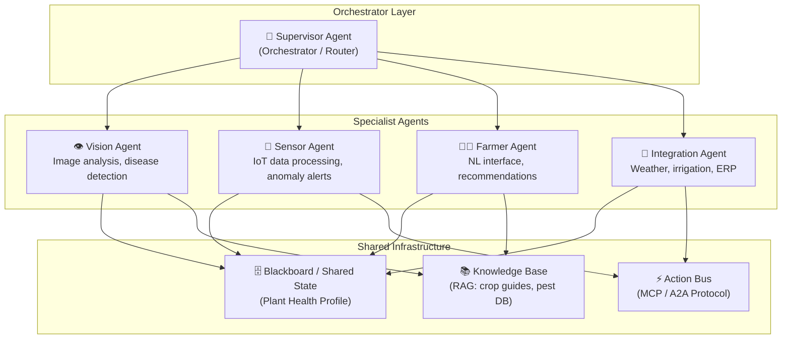
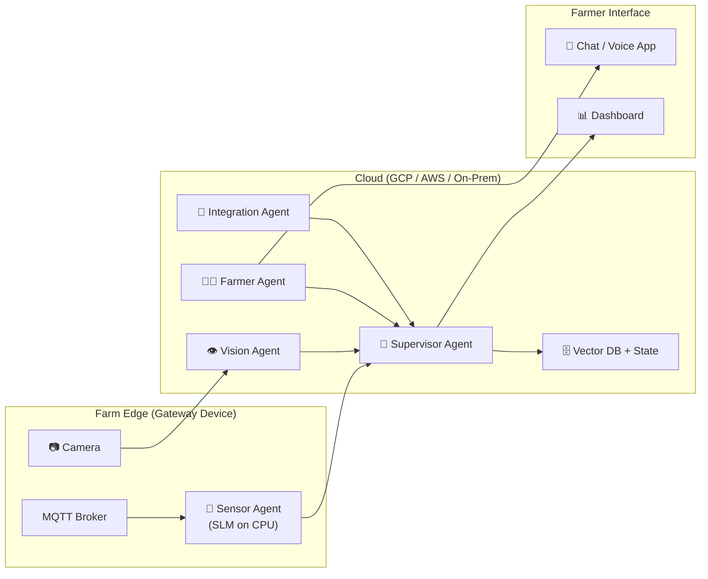

# 🌱 Multi-Agent Plant Monitoring Service — Architecture Proposal

> *A short expert proposal on strategies and architectures for a multiagent service that monitors plants from visual, sensor, farmer interaction, and system integration fronts.*

---

## 1. Problem Statement

Modern agriculture demands holistic plant health monitoring that integrates **multiple modalities**:

| Front | Data Source | Challenge |
|:------|:-----------|:----------|
| **Visual** | Cameras, drones, satellite imagery | Detecting disease, pests, nutrient deficiency from pixels |
| **Sensor data** | IoT sensors (soil moisture, pH, temperature, humidity, light) | Continuous real-time streams, anomaly detection |
| **Farmer interaction** | Natural language (chat, voice), manual observations | Translating domain expertise into actionable inputs |
| **System integration** | Weather APIs, market prices, irrigation controllers, ERP systems | Coordinating actions across external platforms |

No single agent can handle all of these effectively. A **multi-agent system (MAS)** is the natural architecture.

---

## 2. Recommended Architecture: Hierarchical MAS with Specialized Agents

### 2.1 High-Level Design



### 2.2 Why Hierarchical + Blackboard?

Drawing from the **Unified Theory of Agents** taxonomy:

| Dimension | Choice | Rationale |
|:----------|:-------|:----------|
| **Organization** | **Hierarchical** | A Supervisor Agent routes tasks to specialists, preventing chaos from concurrent analysis |
| **Coordination** | **Blackboard** (shared `PlantHealthState`) | All agents contribute to a unified plant profile — the Sensor Agent writes soil data, the Vision Agent writes disease scores, and the Farmer Agent reads all of it |
| **Social behavior** | **Cooperative** | All agents share one goal: maximize plant health |
| **Agent diversity** | **Heterogeneous** | Each agent uses different models and tools suited to its modality |
| **Architecture** | **Hybrid (BDI)** | Agents plan (deliberative) but react to real-time sensor alerts (reactive) |

---

## 3. Agent Specifications

### 3.1 👁️ Vision Agent

**Purpose**: Analyze plant images for disease, pest damage, growth stage, and nutrient deficiency.

| Aspect | Detail |
|:-------|:-------|
| **Model** | Multimodal LLM (e.g., Gemini Pro Vision, Llama 3.2 Vision 90B, GPT-4o) |
| **Tools** | Camera capture API, drone image retrieval, image preprocessing (resize, crop, normalize) |
| **RAG source** | Pest/disease knowledge base with reference images |
| **Output** | Structured diagnosis: `{disease: "early_blight", confidence: 0.87, affected_area: "top_leaves", severity: "moderate"}` |

**Strategy**: Use **Corrective RAG** — after retrieving similar disease images, a verification step confirms the match quality before generating a diagnosis. This prevents false positives.

### 3.2 📡 Sensor Agent

**Purpose**: Process IoT sensor streams, detect anomalies, and trigger alerts.

| Aspect | Detail |
|:-------|:-------|
| **Model** | Small Language Model (SLM, e.g., Phi-3, Qwen 2.5 7B) — lightweight for edge deployment |
| **Tools** | Time-series database reader, anomaly detection algorithm, threshold configurator |
| **Architecture** | **Reactive** — primarily stimulus-response (threshold alerts), with deliberative periodic summaries |
| **Output** | Anomaly alerts: `{sensor: "soil_moisture_plot_3", value: 12%, threshold: 25%, status: "critical"}` |

**Strategy**: Deploy at the **edge** (on-device / on-farm gateway) to ensure low latency and operation during connectivity outages. Use an **iteration cap** and **compaction** to summarize long sensor logs before passing them to the Supervisor.

### 3.3 🧑‍🌾 Farmer Agent

**Purpose**: Natural language interface for the farmer — receives observations, answers questions, delivers recommendations.

| Aspect | Detail |
|:-------|:-------|
| **Model** | Capable conversational LLM (e.g., Gemini Pro, GPT-4o, Claude) |
| **Tools** | Text-to-speech / speech-to-text (for voice in the field), chat UI, notification system |
| **Memory** | **Episodic** (remembers past conversations: "Last week you mentioned yellowing in plot 5") + **Semantic** (crop knowledge) |
| **RAG source** | Local crop management guides, farm-specific historical data |
| **Output** | Plain-language advice, alerts framed in farmer's context |

**Strategy**: Implement the **Auditor Pattern** — recommendations generated by the Farmer Agent are verified against the Blackboard (sensor data + vision analysis) before being delivered. This prevents hallucinated advice.

### 3.4 🔗 Integration Agent

**Purpose**: Bridge between the MAS and external systems.

| Aspect | Detail |
|:-------|:-------|
| **Model** | Tool-calling LLM (can be a smaller, efficient model) |
| **Tools** | Weather API, irrigation controller API, market price API, ERP connector, notification service (SMS/email) |
| **Protocol** | **MCP** (Model Context Protocol) for standardized tool access; **A2A** for communicating with agents from partner platforms |
| **Output** | Executed actions: irrigation adjustments, weather-informed alerts, inventory orders |

**Strategy**: Apply **Human-in-the-Loop (HITL)** for any destructive action (e.g., starting irrigation, placing orders). The agent proposes; the farmer approves via the Farmer Agent's chat interface.

---

## 4. Shared Infrastructure

### 4.1 The Blackboard: Plant Health Profile

All agents contribute to a single, shared state object — the **Plant Health Profile**:

```python
class PlantHealthState(TypedDict):
    plot_id: str
    crop_type: str
    # Vision Agent writes:
    visual_diagnosis: List[Dict]       # disease, severity, confidence
    last_image_timestamp: str
    # Sensor Agent writes:
    soil_moisture: float
    soil_ph: float
    temperature: float
    humidity: float
    anomalies: List[Dict]
    # Farmer Agent writes:
    farmer_observations: List[str]     # "Leaves look yellow in NE corner"
    # Integration Agent writes:
    weather_forecast: Dict
    irrigation_status: str
    # Supervisor writes:
    overall_health_score: float        # 0.0–1.0, synthesized from all inputs
    recommended_actions: List[str]
```

### 4.2 Knowledge Base (RAG)

A **Hybrid RAG** system serving all agents:

- **Vector DB** (ChromaDB or Vertex AI Vector Search): Embedded crop guides, pest identification databases, treatment protocols
- **BM25 index**: For exact-match lookups (chemical names, product codes, sensor model numbers)
- **Graph RAG** (optional, for advanced setups): Knowledge graph of crop-disease-treatment relationships for multi-hop queries like *"What treatment works for early blight on tomatoes in humid climates?"*

---

## 5. Best Strategies — Ranked by Impact

| # | Strategy | From Theory Level | Impact | Effort |
|:--|:---------|:------------------|:-------|:-------|
| 1 | **Auditor Pattern on recommendations** | Level 7 | 🔴 Critical — prevents harmful advice to farmers | Medium |
| 2 | **Edge deployment for Sensor Agent** | Next Frontier (Edge AI) | 🔴 Critical — ensures real-time response, works offline | Medium |
| 3 | **Multimodal Vision via RAG** | Levels 4, 6, 8 | 🟠 High — image + knowledge = accurate diagnosis | Medium |
| 4 | **Blackboard shared state** | Level 7 | 🟠 High — unifies all modalities into one profile | Low |
| 5 | **HITL for destructive actions** | Level 0 | 🟠 High — safety for irrigation, purchases | Low |
| 6 | **MCP for tool interoperability** | Next Frontier | 🟡 Medium — future-proofs integrations | Low |
| 7 | **Episodic memory for Farmer Agent** | Prologue (MemGPT) | 🟡 Medium — personalized, context-aware advice | Medium |
| 8 | **Context engineering / compaction** | Next Frontier | 🟡 Medium — keeps long-running agents effective | Medium |

---

## 6. Technology Stack Recommendation

| Layer | Technology | Rationale |
|:------|:----------|:----------|
| **Orchestration** | **LangGraph** (StateGraph) | Proven for hierarchical MAS with conditional routing; Python-native |
| **Vision model** | **Gemini Pro Vision** or **Llama 3.2 Vision** (local via Ollama) | Best multimodal results; local option for privacy/cost |
| **Sensor processing** | **Qwen 2.5 7B** on edge device | Small, efficient, runs on CPU gateway |
| **Conversational model** | **Gemini Pro** or **GPT-4o** | Strong reasoning + conversation + multilingual |
| **Vector DB** | **ChromaDB** (local) or **Vertex AI Vector Search** (cloud) | Depends on scale and deployment model |
| **IoT connectivity** | **MQTT** → time-series DB (InfluxDB / TimescaleDB) | Industry-standard for sensor streams |
| **External tool protocol** | **MCP** | Standardized tool schemas, vendor-agnostic |
| **Agent-to-agent comms** | **A2A Protocol** | For future interop with external agricultural platforms |
| **Interface** | **Gradio** or **WhatsApp API** | Farmer-friendly; voice-capable |

---

## 7. Deployment Architecture



**Key design decisions**:
- **Sensor Agent runs at the edge** — processes streams locally, only sends anomalies and summaries to the cloud
- **Vision Agent runs in the cloud** — requires GPU for multimodal inference
- **Farmer Agent is cloud-based** but accessible through mobile (WhatsApp, Gradio, or custom app)
- **All agents write to the Blackboard** in the cloud; the Supervisor synthesizes and triggers actions

---

## 8. MVP Roadmap (Phased)

| Phase | Scope | Duration |
|:------|:------|:---------|
| **Phase 1** | Sensor Agent (anomaly alerts) + Farmer Agent (chat) + basic Blackboard | 4–6 weeks |
| **Phase 2** | Vision Agent (disease detection with RAG) + Supervisor routing | 4–6 weeks |
| **Phase 3** | Integration Agent (weather + irrigation control with HITL) | 3–4 weeks |
| **Phase 4** | Auditor verification + episodic memory + edge deployment | 4–6 weeks |

---

## 9. Conclusion

The best architecture for a multi-front plant monitoring service is a **Hierarchical, Cooperative, Heterogeneous MAS** coordinated via a **Blackboard pattern** implemented as a LangGraph `StateGraph`. This mirrors the proven patterns from the Unified Theory (Levels 7–8) while incorporating cutting-edge strategies from the frontier (Edge AI, MCP, Context Engineering).

The key insight is that **each monitoring front maps naturally to a specialized agent** — and the Blackboard pattern ensures that no agent operates in isolation. The whole is greater than the sum of its parts: a Vision Agent that knows the soil is dry (from the Sensor Agent) and the farmer saw yellowing yesterday (from the Farmer Agent) will produce far more accurate diagnoses than any single-modality system.

> *"An agent is an LLM in a `while` loop. A multi-agent system is multiple loops sharing a blackboard."*
